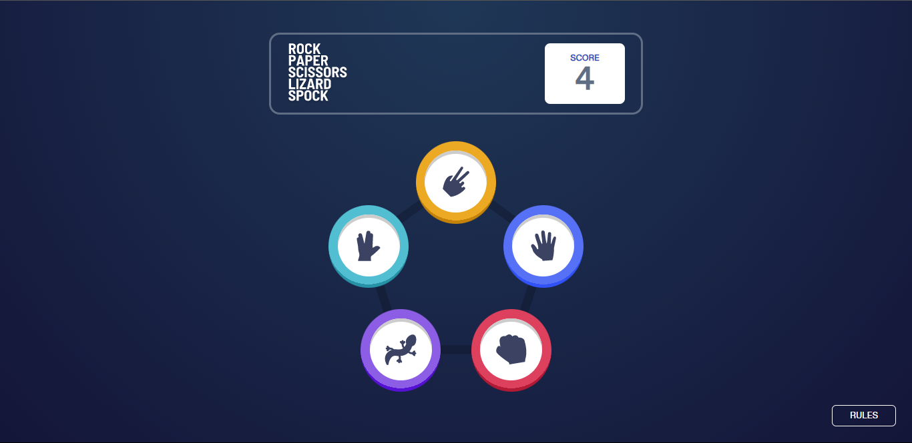
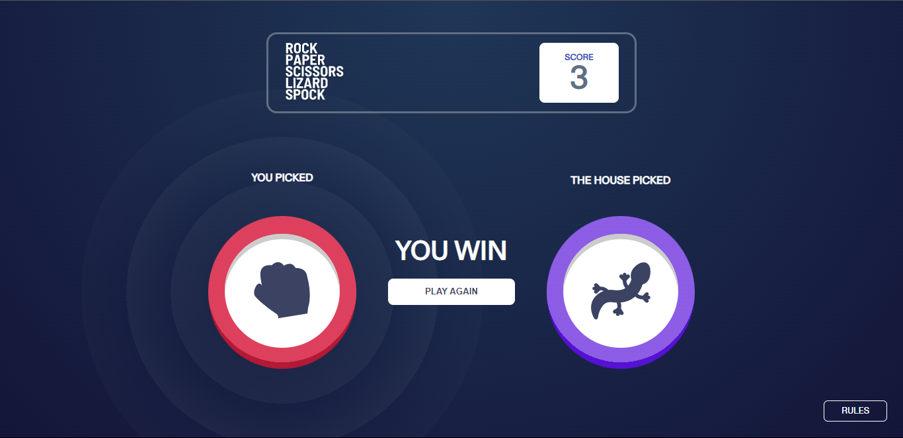
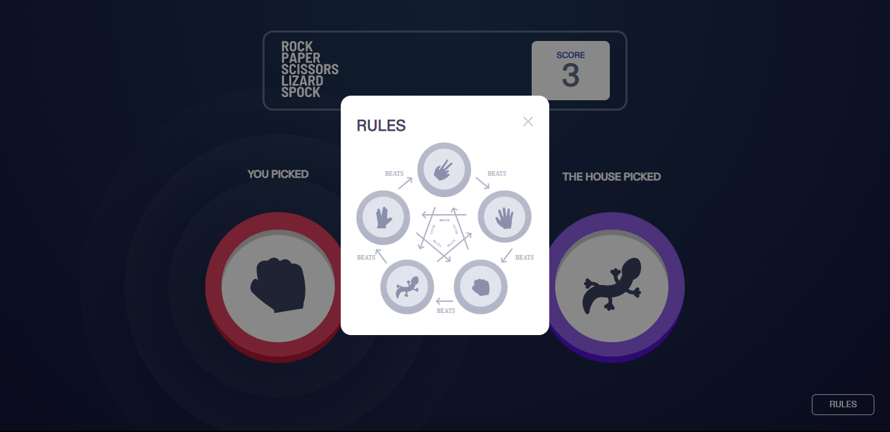
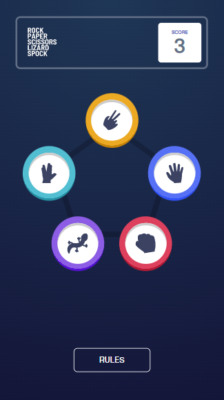
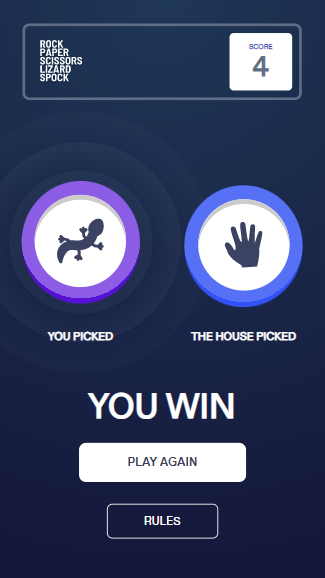
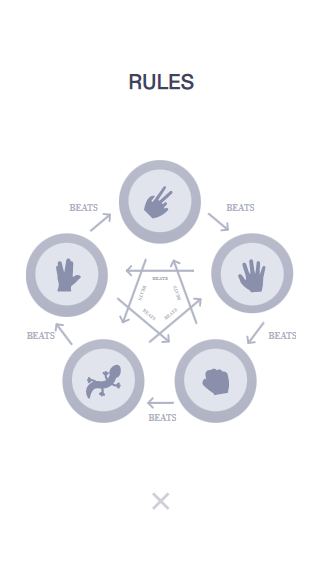

<main 
  style="
    width: 200%;
    max-width: 85vw;
    display: flex;
    flex-direction: column;
    gap: 1rem;
    padding: 2rem 0;
  " 
>

# Frontend Mentor - Rock, Paper, Scissors solution

This is a solution to the [Rock, Paper, Scissors challenge on Frontend Mentor](https://www.frontendmentor.io/challenges/rock-paper-scissors-game-pTgwgvgH). Frontend Mentor challenges help you improve your coding skills by building realistic projects.

## Table of contents

- [Overview](#overview)
  - [The challenge](#the-challenge)
  - [Screenshot](#screenshot)
  - [Links](#links)
- [My process](#my-process)
  - [Built with](#built-with)
- [Author](#author)

## Overview

### The challenge

Users should be able to:

- View the optimal layout for the game depending on their device's screen size
- Play Rock, Paper, Scissors, Lizard, Spock against the computer
- Maintain the state of the score after refreshing the browser

### Screenshot

#### Desktop designs

#### Movile designs

  
  
  

### Links

- Solution URL: [Github solution](https://github.com/DF27ARTS/Rock_Paper_Scissors_Mentor_Challenge)
- Live Site URL: [Live site](https://df27arts.github.io/Rock_Paper_Scissors_Mentor_Challenge/)

## My process

### Built with

- Semantic HTML5 markup
- CSS custom properties
- Flexbox
- CSS Grid
- SASS preprocessor

## Author

- Website - [Fernando Rojas](https://portfoliio-three.vercel.app/)
- Frontend Mentor - [@DF27ARTS](https://www.frontendmentor.io/profile/DF27ARTS)
- Twitter - [@\_DF_Fernando](https://twitter.com/_DF_Fernando)

</main>
